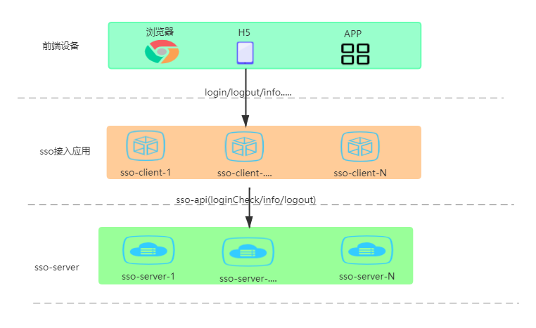
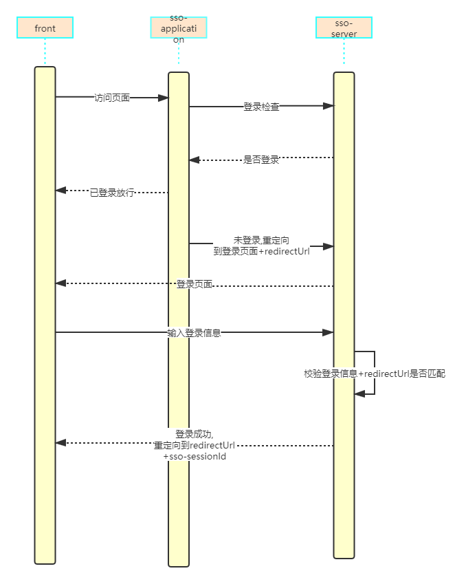

# little-sso

## 简介
little-sso 一个轻量级的单点登录系统，支持浏览器（cookie）模式和非浏览器（移动端，和异构系统）

## 术语介绍
- sso   
  单点登录  

- sso-client  
  接入sso系统的应用

- cookie   
  网站为了辨别用户身份，进行Session跟踪而储存在用户本地终端上的数据（通常经过加密），
  由用户客户端计算机暂时或永久保存的信息   
  **同一主域名下的cookie浏览器会自动传递给服务端**

- session    

  在计算机中，尤其是在网络应用中，称为“会话控制”。Session对象存储特定用户会话所需的属性及配置信息。这样，当用户在应用程序的Web页之间跳转时，存储在Session对象中的变量将不会丢失，而是在整个用户会话中一直存在下去。当用户请求来自应用程序的 Web页时，如果该用户还没有会话，则Web服务器将自动创建一个 Session对象。当会话过期或被放弃后，服务器将终止该会话。Session 对象最常见的一个用法就是存储用户的首选项。  

  服务端存储session: 借助redis等实现即可  

  client存储session: 基于token,jwt等  

## 模块简介
- sso-server sso登录server端  

- sso-core sso登录server端核心实现,借助此包,可快速实现一个sso登录server端  

- sso-client sso登录服务client端,借助此包,可快速接入sso系统

- example 接入示例

cookie-example 基于cookie的sso系统,服务端存储session  

noCookie-example 不基于cookie的sso系统,服务端存储session    

clientSession-token-example 基于token的sso系统,服务端不存储session,client端存储session  

## 总体设计

###  登录流程

### 退出流程