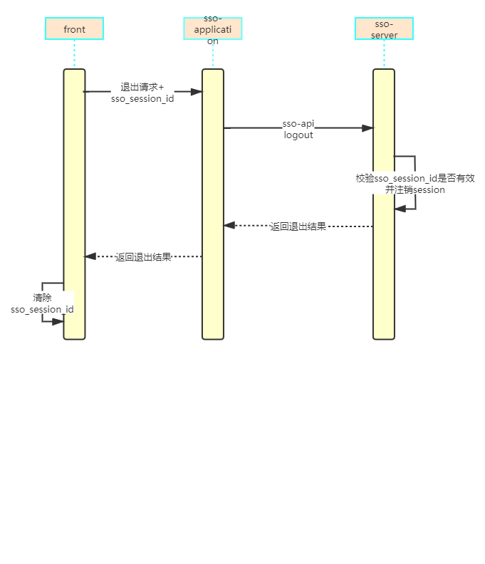

# little-sso

## 简介
little-sso 一个轻量级的单点登录系统，支持浏览器（cookie）模式和非浏览器（移动端，和异构系统）

## 术语介绍
- sso   
  单点登录  

- sso-client  
  接入sso系统的应用

- cookie   
  网站为了辨别用户身份，进行Session跟踪而储存在用户本地终端上的数据（通常经过加密），
  由用户客户端计算机暂时或永久保存的信息   
  **同一主域名下的cookie浏览器会自动传递给服务端**

- session    

  在计算机中，尤其是在网络应用中，称为“会话控制”。Session对象存储特定用户会话所需的属性及配置信息。这样，当用户在应用程序的Web页之间跳转时，存储在Session对象中的变量将不会丢失，而是在整个用户会话中一直存在下去。当用户请求来自应用程序的 Web页时，如果该用户还没有会话，则Web服务器将自动创建一个 Session对象。当会话过期或被放弃后，服务器将终止该会话。Session 对象最常见的一个用法就是存储用户的首选项。  

  服务端存储session: 借助redis等实现即可  

  client存储session: 基于token,jwt等  

## 模块简介
- sso-server sso登录server端  

- sso-core sso登录server端核心实现,借助此包,可快速实现一个sso登录server端  

- sso-client sso登录服务client端,借助此包,可快速接入sso系统

- example 接入示例

cookie-example 基于cookie的sso系统,服务端存储session  

noCookie-example 不基于cookie的sso系统,服务端存储session    

clientSession-token-example 基于token的sso系统,服务端不存储session,client端存储session  

## 总体设计


###  登录


### 退出




## 接口设计

### sso-server 接口返回值包装

<span style="color:red"> 备注: </span> **sso-server 所有json返回结果包装结构**

Result:

```json
{
	code: "消息码",
	msg: "消息描述",
	data: {},//真实返回值
	ext: {} //扩展结果
}
```


### sso-server 消息码

| 消息码 | 描述                                 |
| ------ | ------------------------------------ |
| 1      | 成功                                 |
| 0      | 失败                                 |
| 500    | sso-server 服务异常,具体参见消息描述 |
| 9999   | 登录检查失败                         |


### sso-server 接口
####  登录接口

- path

    /sso/login POST 

- 参数  

   username=xxx,password=md5(xxx),redirectUrl=xxxx

- 返回值

  ```json
  {
   redirectUrl:'跳转地址'
  }
  ```

  

  

  

  

#### 退出接口

- path

    /sso/logout GET

- 参数  

  sso_session_id(参数名称可配置)

- 返回值 同 Result

  

#### 登录检查接口

- path

    /sso/loginCheck GET

- 参数  

   sso_session_id(参数名称可配置)

- 返回值 同 Result

  

#### 用户信息接口

- path

    /sso/user GET

- 参数  

   sso_session_id(参数名称可配置)

- 返回值(用户信息可执行扩展)

```json
     {
      sessionId:'sessionId',
      userId:'用户id',
      username:'username'
     }
```

#### clienSession模式的用户详情接口

- path

    /sso/token/userDetail GET

- 参数  

   sso_session_id(参数名称可配置)

- 返回值 同 Result data 可执行填充详细信息


#### clienSession模式 token续期接口

- path

  /sso/token/refresh POST

- 参数  

  refreshToken=xxx

- 返回值 

```json
{
    sessionToken:'会话token',
    refreshToken:'续期token,过期时间长期sessionToken',
    expire:'过期时间,单位秒'
}
```


## 如何编写自己的sso-server

- 下载 little-sso项目
- 根据自己的需求修改sso-server的相关接口,或直接引入 sso-core 自定义实现sso-server,注意同时修改sso-client
- 或者只修改 sso-server的 UserService实现即可,对接自己的账户系统

